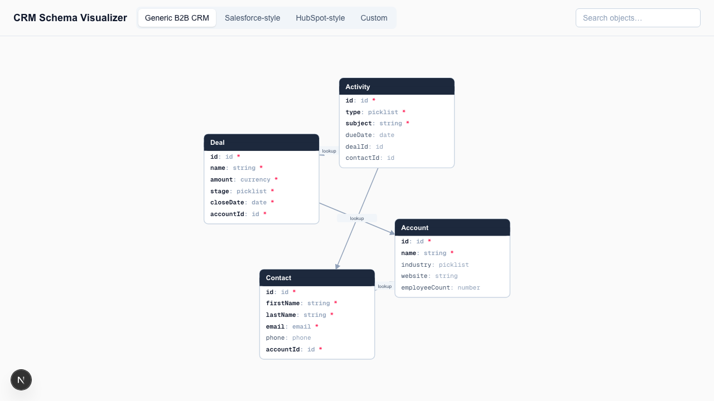
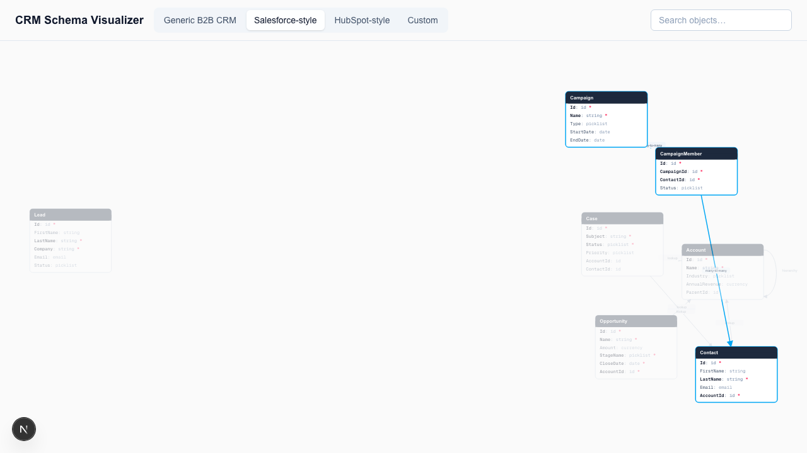

# CRM Schema Visualizer

A visualizer that turns CRM objects and relationships into an understandable data model.

[Live Demo](https://crm-schema-visualizer.vercel.app) · Day 032 of a 100-day building challenge · [Plan](./PLAN.md)

## Why I Built This

A CRM's data model is invisible. Anyone integrating with a CRM, onboarding onto a
team's instance, or evaluating a platform has to reconstruct the object graph —
which objects exist, which fields they carry, how they relate — by clicking through
admin screens or reading API docs object-by-object. There's no single picture of
"here is the shape of this CRM," so the same reverse-engineering happens over and
over, by hand.

## What It Does

Loads a CRM object model — one of three built-in presets, or your own pasted JSON —
and renders it as an ER-style diagram: one box per object, its fields listed inline,
lines connecting related objects. Click an object to trace its direct relationships;
search to jump straight to one; drag a box if the auto-layout overlaps; scroll to
zoom, drag empty canvas to pan.

## Demo

**Generic B2B CRM preset — default view:**



**Salesforce-style preset — click-to-highlight, tracing `CampaignMember`'s relationships (the many-to-many junction between `Campaign` and `Contact`) with the rest of the schema dimmed:**



## How It Works

1. Pick a preset (Generic / Salesforce-style / HubSpot-style) or switch to Custom
   and paste a JSON schema — click "Load Example" to see the expected shape.
2. The schema is validated client-side. Malformed JSON and a structurally invalid
   schema (e.g. a relationship pointing at an object name that doesn't exist) each
   get their own specific error message.
3. `d3-force` computes an initial layout — objects push apart, relationships pull
   connected objects together — run synchronously to convergence, not animated.
4. The diagram renders as SVG: one box per object with its field list inline,
   lines for relationships with a type badge and a hover tooltip.
5. Click an object to highlight its direct relationships and dim the rest; type in
   the search box to do the same for a name match; drag a box to reposition it;
   scroll/drag the canvas to zoom and pan.

## Architecture

- **`lib/types.ts`** — the `CrmSchema` domain types (`SchemaObject`, `SchemaField`,
  `SchemaRelationship`) shared by presets, the validator, the layout function, and
  the UI.
- **`data/presets/*.ts`** — three hand-authored `CrmSchema` objects (Generic,
  Salesforce-style, HubSpot-style), committed as typed source.
- **`lib/validate-schema.ts`** — a pure, hand-rolled validator:
  `validateCrmSchema(raw: unknown) => { ok: true; schema } | { ok: false; error }`,
  with a distinct, specific error for every way a pasted schema can be malformed.
- **`lib/layout.ts`** — wraps `d3-force` in a pure function,
  `computeLayout(schema) => Record<objectName, {x, y}>`, ticked synchronously to
  convergence so it's deterministic and unit-testable rather than an animated
  simulation loop.
- **`app/components/SchemaCanvas.tsx`** — owns the interactive SVG canvas:
  merges computed layout with per-box drag overrides, click/search-driven
  highlight state, and pan/zoom viewBox state.
- **`app/components/ObjectBox.tsx`** / **`EdgeLine.tsx`** — one object box and one
  relationship connector, respectively. No diagram/graph framework — hand-rolled
  SVG and Tailwind.
- **`app/page.tsx`** — preset selector, the custom-JSON panel (textarea + "Load
  Example" + error display), and the search box.

Everything is client-side. No backend, no database, no live CRM connection —
presets are static imports and custom schemas are validated and laid out entirely
in the browser.

## Key Decisions & Tradeoffs

- **Decision:** every relationship reduces to one primitive — one-to-many —
  reused three ways (a plain lookup, a self-referencing hierarchy where
  `from === to`, and many-to-many modeled as a real junction object with two
  one-to-many edges into it).
  **Why:** one edge type means one piece of drawing/validation logic instead of
  three, and a junction-object-as-a-real-box is how CRMs actually implement
  many-to-many (e.g. Salesforce's `CampaignMember`), so the diagram stays
  accurate to the underlying data model instead of abstracting it away.
  **Tradeoff:** a many-to-many relationship costs an extra box on the canvas
  instead of a single clean edge between the two "real" objects.

- **Decision:** presets are hand-authored TypeScript objects, not pulled from a
  live CRM.
  **Why:** zero OAuth setup, ships in one session, and the object models are
  recognizable approximations of real Salesforce/HubSpot schemas — accurate
  enough to demonstrate the tool without needing real API credentials.
  **Tradeoff:** presets will drift from whatever the real platforms' schemas
  look like today; they're illustrative, not authoritative.

- **Decision:** dragged node positions live in component state only, not
  persisted to `localStorage` or the URL.
  **Why:** kept the state model simple for a single-session build — no
  serialization format to design and version.
  **Tradeoff:** repositioning a messy auto-layout doesn't survive a reload.

## Getting Started

### Prerequisites

Node.js 20+, npm.

### Installation

```bash
npm install
```

### Configuration

None. No environment variables, no API keys — everything is static/client-side.

### Run Locally

```bash
npm run dev
```

Open [http://localhost:3000](http://localhost:3000).

## Usage

- Click **Generic B2B CRM** / **Salesforce-style** / **HubSpot-style** to switch
  presets.
- Click **Custom**, then **Load Example** to see a sample schema (a self-referencing
  hierarchy and a many-to-many junction included), or paste your own JSON in the
  same shape.
- Click any object box to trace its direct relationships.
- Type in the search box (top right) to highlight a matching object.
- Drag a box to reposition it; scroll to zoom; drag empty canvas to pan.

## Validation / Testing

- `npm test` runs the vitest suite:
  - `lib/validate-schema.test.ts` — a valid schema passes; every malformed-shape
    case (missing `objects`/`relationships`, an object with zero fields, an
    invalid field/relationship `kind`, a relationship referencing an unknown
    object, duplicate object names) fails with its specific message.
  - `lib/layout.test.ts` — every object gets a finite `{x, y}`; layout is
    deterministic for a given schema; a single-object schema and a
    self-referencing relationship don't produce `NaN`.
- Manual pass in-browser: all 3 presets render correctly; custom JSON renders a
  valid schema and gives distinct errors for invalid-JSON-syntax vs.
  invalid-schema-shape; click-to-highlight, hover tooltips, drag-to-reposition,
  zoom/pan, and search all verified against a running dev server.

## Limitations

- Read-only. No adding/editing objects, fields, or relationships in the browser.
- No live CRM connection — presets are static, custom schemas come from pasted
  JSON, not an API.
- No export (PNG/SVG download) of the rendered diagram.
- Dragged node positions and zoom/pan state reset on reload or on switching
  preset/custom schema.
- The auto-layout (`d3-force`) can overlap boxes on a schema with many
  relationships; dragging is the only way to clean it up, per-session.

## What I'd Build Next

- Export the diagram as a PNG/SVG image.
- Live CRM API introspection (Salesforce/HubSpot OAuth) as an alternative to the
  hand-authored presets.
- An editable schema builder (add/edit/delete objects, fields, relationships).
- Persist dragged node positions (e.g. to `localStorage`) across reloads.
- Field-row-level edges — connect the exact FK field row to its target object
  instead of box-to-box.

## License

MIT.
